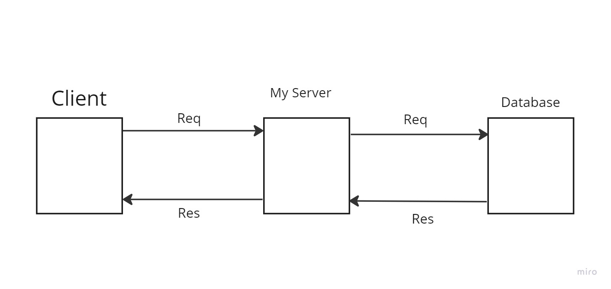

# Movies-Library

 Movies-Library-lab 13

**Author Name**: mohammad Shahin

## WRRC
<!-- Add an image of your WRRC here -->

## Overview

### in today's lab, i connected my server with a  database after i created it, i added two new routs postmovies to add the movie information and git movie to send the information to the website

## Getting Started
<!-- What are the steps that a user must take in order to build this app on their own machine and get it running? -->
### first of all i needed to install and upload pg packages for this lab . then specifiy  the ruets acording to the lab instructions.then i created a database in my local machine. lastly i will build function to only responde with needed data one for posting the information the other is to get tose information and send it as a reqest

## Project Features
<!-- What are the features included in you app -->
### the project contains 9 routes that will help navigat the site. Also it contains middilware functions in case of any error